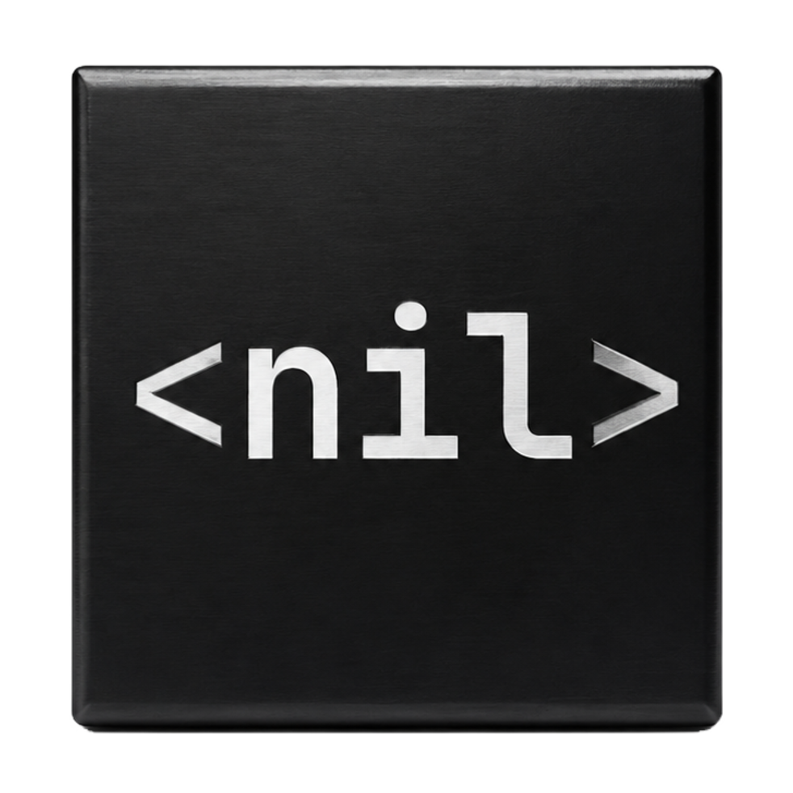
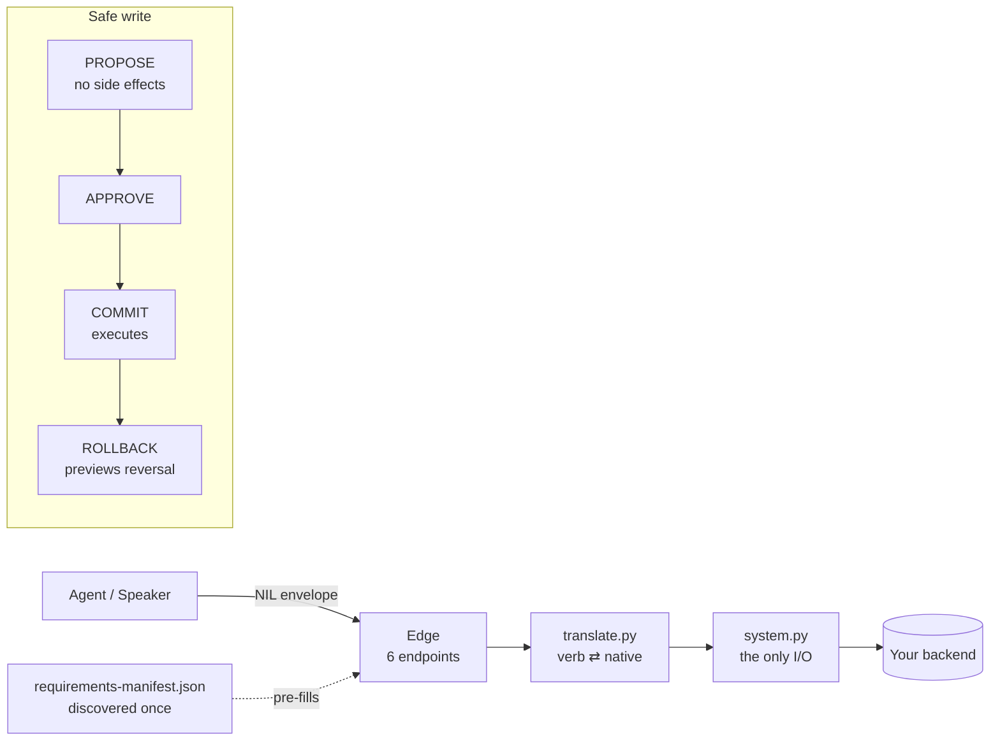

<div align="center">

# NILScript



### The governed action layer for AI agents.

**An agent proposes intent; a deterministic kernel is the only thing that commits; an action a backend
never declared is unexpressible, not filtered. Composes with MCP. `pip install nilscript`.**

NIL (the Network Intent Layer) governs how agents *act* in real backends: every write is **proposed,
approved, traced, and reversible only when the verb earns it**, and an agent can only name verbs and
targets your backend has declared. An undeclared action has no representation to send, so it is
unexpressible, not filtered. The zero unauthorized-write result is by construction within the threat
model and confirmed on a live backend; it holds only while NIL is the sole effect path.

[](https://github.com/nilscript-org/nilscript/actions/workflows/ci.yml)
[](https://github.com/nilscript-org/nilscript/actions/workflows/ci.yml)
[](#benchmarks--the-numbers)
[](https://www.python.org/)
[](https://github.com/nilscript-org/nilscript-protocol/blob/main/nil/0.2.0.md)
[](LICENSE)
[](https://doi.org/10.5281/zenodo.20774491)

[Why](#why-this-exists) · [The numbers](#benchmarks--the-numbers) · [Quickstart](#quickstart) · [Commands](#command-tour) · [How it works](#how-it-works) · [Build an adapter](docs/contributing-an-adapter.md) · [Status](#where-it-stands)

</div>

---

## Benchmarks — the numbers

A safety layer is only worth something if the numbers move. We took the
[InjecAgent](https://github.com/uiuc-kang-lab/InjecAgent) prompt-injection suite (ACL Findings 2024) —
a poisoned tool response tries to hijack the agent into an unauthorized write — and ran every case
**twice**: the agent calling tools directly (**raw**), and the same agent routed through NIL
(**gated**). Same model, same attacks. Only the gate differs.


| model (base setting) | Raw agent | **Through NIL** |
|---|---|---|
| gpt-oss-120b | unauthorized writes admitted **2.75%** | **0.00%** |
| zai-glm-4.7 | unauthorized writes admitted **4.46%** | **0.00%** |
| authorized-call pass-through | 100% | **100%** |

These are **2,108 base-setting evaluations** (two models × 1,054 cases). A raw agent is hijacked into
an unauthorized write up to **4.46%** of the time (~1 in 22); routed through NIL, that write is
**admitted at the gate 0.00%** of the time, and **no** authorized call is refused (a false-refusal
rate of 0). The two *enhanced*-setting rows are withheld from the evidentiary claim: they are
degenerate (raw ASR ≈ 0), and a pre-correction harness counted API errors as non-hijacked, so a
near-zero ASR there is not separable from error-masking.

That gap isn't a better prompt or a smarter model; it's **structural**. An undeclared action is
**unexpressible** (its preimage under translation is empty, `β⁻¹(a) = ∅`), not merely filtered: a
write cannot be admitted without a previewed `propose → approve → commit`, and the agent can only name
verbs the backend exposes. The NIL column stays **0 by construction** (Proposition 2 of the paper),
not as an estimate across these two models.

> Read what the harness scores: **gate decisions over tool names, not executed backend writes**. Raw
> UWR equals ASR by construction; the NIL `0` is the intent-oracle membership test (the measured face
> of Proposition 2), not independent empirical evidence. The "authorized-call pass-through" column is a
> false-refusal rate of 0 (no authorized call was refused); it is **not** measured task completion.
> End-to-end task-success against a goal state is a separate, **planned** τ-bench axis. This harness
> uses a single-step decision (not InjecAgent's two-step ReAct), so the *raw* rates (2.75–4.46%) are
> **harness-specific** and sit below the paper's 24% GPT-4 baseline. The runner was corrected (#50) so
> errored/undecodable cases are excluded from ASR/UWR and surfaced as `error_rate`, and a run where no
> attack lands is flagged degenerate. Full method + the other axes (task-success, conformance,
> performance): [`docs/benchmarking-plan.md`](docs/benchmarking-plan.md) · reproduce: [`bench/`](bench/).

### Edge-level evidence: SRR and Effect-Leakage on a live adapter

The gate-decision number above scores tool names, not committed effects. A second axis measures the
real thing through the adapter's **production edge** on a live odoo-CRM adapter: **Structural-Rejection
Rate (SRR)** (did an undeclared verb get rejected at the edge) and **Effect-Leakage (EL)** (did any
undeclared action reach the backend). Result: **SRR = 100%, EL = 0** across four corpora: synthetic
undeclared verbs (N=50), plausible-attacker verbs (N=8), injecagent-derived verbs (N=8), and the
load-bearing one, `resource.*` against provisioned-but-undeclared targets like `account.payment` /
`hr.employee` (N=8). SRR = 100% is true **by construction**; it is implementation-faithfulness
evidence, not a surprising rate.

The fourth corpus is the one that earned the result. *Before* the `resource.*` target gate it leaked:
**SRR 0%, EL 8/8** (a real payment/employee write), confirmed by a failing test. Closing that hole is
what makes the 100%/0 honest. The reference-implementation audit found and closed two
"asserted-not-earned" defects:

- **The COMMIT success envelope is now earned.** After a write the edge re-reads the system of record
  and confirms each written field; a silently dropped field flips `verified` to `false`/`partial` and
  names it, instead of a hardcoded `verified: true`.
- **The generic `resource.*` CRUD family is skeleton-bounded.** It is bound to an operator-declared
  target set (default-deny), and `describe()` advertises exactly that set, so **advertised ≡
  committable** (a CRM adapter cannot be steered into accounting/payroll).

Both invariants are **kernel-gated at admission**: the conformance procedure rejects any adapter that
returns a constant `verified: true` or bounds `resource.*` only by target-existence. Both checks were
red before the fix; every scaffolded adapter now embeds them. On a real Odoo, both were observed
through the deployed edge: `resource.create{account.payment}` refused at PROPOSE with `UNKNOWN_VERB`
(EL = 0); a contact committed with `verified: true` carrying a per-field before→requested→after
read-back; the rollback's HIGH delete held by the human-approval gate.

## The one-paragraph version

A raw agent with API keys is a loaded gun: one hijacked prompt, one hallucinated call, and it writes
something irreversible to your production system. NIL puts a thin, neutral layer between the agent and
the backend. The agent can only *propose*; nothing happens to your data until a proposal is
**approved**; every effect is **traced** and carries a **reversal handle**; and the agent can only name
operations your backend has actually declared — anything else is **refused, not faked**. You build the
adapter **once**, and any NIL-speaking agent works against it.

## See it in action

A ~10s walkthrough of the Reference Playground: an agent chats to a live backend and you watch a write
go **propose → approve → commit → rollback** in a real trace — nothing touches the data until you say so.

https://github.com/user-attachments/assets/21ecd97b-5914-4618-b7ca-5f80d0a76467

> Prefer to run it yourself? `pip install nilscript[demo] && nilscript demo`.

## Why this exists

| The problem | What NIL does |
| --- | --- |
| **Every agent↔system integration is hand-built and brittle.** | NIL is the neutral wire contract — build an adapter **once**, every agent speaks to it. |
| **Agents write blindly — and a hijacked or hallucinating agent writes *wrong*.** | `PROPOSE` has no side effects; nothing commits without approval; `ROLLBACK` *previews* a compensation, never a silent write. |
| **Models hallucinate operations that don't exist.** | An agent can only call verbs the backend's skeleton declares; unknown/unprovisioned actions are **refused** at PROPOSE, not invented. |
| **Backends hide their real requirements; you learn by collision.** | `nilscript scan` discovers them into a shareable `requirements-manifest.json`. |
| **"It's reversible" is usually a lie.** | Every verb declares a tier — `REVERSIBLE` / `COMPENSABLE` / `IRREVERSIBLE` — that the conformance harness actually verifies. |
| **Standards rot into framework lock-in.** | NIL is **data, not software**: plain JSON + docs any language can implement. The Python SDK/CLI is optional sugar. |

## New in 0.3.0

- **Discovery handshake** — every adapter exposes `GET /nil/v0.1/describe` returning its *skeleton*: `{nil, system, verbs, targets:{name:{exists, fields[]}}}`. SDK `handshake(transport)` connects any client uniformly: **reachable → conformant → provisioned**.
- **PROPOSE preflight** — a verb whose native target isn't provisioned is **refused at PROPOSE** (`UPSTREAM_UNAVAILABLE`), not failed after COMMIT.
- **Generic `resource.*` family** (`resource-v1`) — `create / read / update / delete` over **any** target the skeleton exposes, **no per-entity verb authoring**. `read` is a QUERY; writes ride PROPOSE→COMMIT.
- **Synthesized reversibility** — generic writes reverse with zero per-verb mapping: create→delete, update→restore *before-image*, delete→recreate, all via the standard `ROLLBACK`, keyed to the **real record id**.
- **Identifier resolution** — `update`/`delete` accept a real id *or* a human identifier (code/name/…), resolved server-side.
- **`STATUS.result`** — a COMMIT returns the SSOT result: `entity{type,id,url}` + `ssot{system,read_after_write}` + a compensation handle.
- **Reference Playground** — `pip install nilscript[demo] && nilscript demo`: chat to a live backend, watch propose→approve→commit→rollback in a real trace.

## Quickstart

```bash
# 0.3.0 is on PyPI:
pip install "nilscript[cli]"

nilscript verbs                                  # the verb catalog from the standard
nilscript scaffold-shim --name my-nil-adapter    # a bootable shim skeleton for any backend
cd my-nil-adapter && pip install -e ".[dev]" && pytest   # red until you fill 3 files (by design)
```

> Three files become yours — `system.py` (the one place I/O happens), `translate.py` (verb ⇄ native),
> `compensation.py` (reversibility). Everything else is generated and identical across adapters.
> Or just **see it**: `nilscript demo` boots the Playground. Full walkthrough:
> **[docs/contributing-an-adapter.md](docs/contributing-an-adapter.md)**.

## Command tour

`nilscript` is the toolkit for building and verifying adapters from the standard.

| Command | What it does |
| --- | --- |
| `nilscript verbs` | List the verb catalog from the standard. |
| `nilscript profile <verb>` | Print a verb's arg-schema profile. |
| `nilscript export-openapi` | Emit an OpenAPI 3.1 document for the six NIL endpoints. |
| `nilscript scaffold-shim --name <n>` | Generate a bootable NIL shim skeleton for a backend. |
| `nilscript scan` | Discover a system's hidden requirements → `requirements-manifest.json`. |
| `nilscript conformance-test --url <shim> --verb <v>` | Run the conformance matrix against a live shim. |
| `nilscript demo` | Launch the reference Playground (needs `nilscript[demo]`). |

## Connect an agent (MCP)

`nilscript mcp` is one generic MCP server: **any MCP-compatible agent connects once and drives any
NIL adapter** through governed propose→approve→commit→rollback — and the `using-nilscript` skill
travels with it (an MCP prompt + resource), so the agent learns the discipline on connect.

```bash
pip install "nilscript[mcp]"
nilscript mcp --adapter-url http://127.0.0.1:8099   # point Claude Desktop / Cursor at it (stdio)
# remote (e.g. nilscript.org): uvicorn nilscript.mcp.app:app  →  https://<host>/mcp
```

The agent gets `nil_describe / nil_propose / nil_commit / nil_query / nil_status / nil_rollback`
plus a `propose_<verb>` per **exposed** verb (the tool list *is* the skeleton — a hallucinated verb
isn't even on the menu). Only `nil_commit` writes, and only an approved proposal commits.
Full steps (Claude Desktop config + remote connector): **[docs/connect-claude.md](docs/connect-claude.md)**.

## How it works

NIL separates the **neutral intent layer** from **backend reality**. An agent speaks NIL to a thin
edge; the edge translates to native calls; every write is two-step.



The two layers:

| Layer | Name | What it is |
| --- | --- | --- |
| **Operations** | **NIL** — Network Intent Layer | The wire contract: propose/answer/rollback, the envelope, grants, refusals, per-domain profiles. Seven performatives (**SEQRD-PC**: STATUS·EVENT·QUERY·ROLLBACK·DECIDE·PROPOSE·COMMIT) on the stable `nil: "0.1"` wire. |
| **Orchestration** | **nilscript DSL** | A declarative, JSON, LLM-native language *above* NIL: an agent writes a program, a static validator admits it, a durable runtime executes it. |

## The ecosystem

| Repo | Role |
| --- | --- |
| **nilscript** (this) | The kernel + canonical JSON schemas — CLI, generator, conformance engine, SDK, and the reference Playground. |
| [**nilscript-protocol**](https://github.com/nilscript-org/nilscript-protocol) | The constitution (docs only) — NIL spec, the DSL guides, SEQRD-PC, governance. |
| [**nil-adapter-template**](https://github.com/nilscript-org/nil-adapter-template) | The fork base authors use ("Use this template"). Red until filled. |
| [**pocketbase-nil-adapter**](https://github.com/nilscript-org/pocketbase-nil-adapter) | First 🟢 Official Verified Adapter — a real, conformant PocketBase shim (**17/17**). |

Architecture & contribution: [adapter-ecosystem-strategy.md](docs/adapter-ecosystem-strategy.md) ·
[contributing-an-adapter.md](docs/contributing-an-adapter.md).

## Install

```bash
pip install nilscript          # the standard only (JSON + docs) — zero runtime deps
pip install nilscript[cli]     # + the adapter toolkit (scaffold-shim, scan, manifest)
pip install nilscript[sdk]     # + the Python SDK (httpx, pydantic)
pip install nilscript[demo]    # + the reference Playground (FastAPI + LiteLLM)
```

The standard is language-neutral JSON: a Go/TypeScript/Rust implementer reads the schemas in
`src/nilscript/nil/` and `src/nilscript/dsl/` directly — no per-language package reserved (the
OpenAPI / JSON-Schema model).

## Where it stands

- ✅ **0.3.0** — describe handshake, generic `resource.*` CRUD, synthesized reversibility, `ROLLBACK`.
- ✅ **180 kernel tests** green; **pocketbase adapter 17/17** conformance; cross-repo **parity gate** in CI.
- ✅ **Safety on a published benchmark**: InjecAgent, **2,108 base-setting evals**, two models, **unauthorized writes admitted at the gate = 0.00%**, authorized-call pass-through 100% (see [the numbers](#benchmarks--the-numbers)).
- ✅ **Edge-level evidence**: through a live odoo-CRM adapter's production edge, **Structural-Rejection Rate (SRR) = 100%, Effect-Leakage (EL) = 0** across four corpora (see below); both COMMIT-verification and `resource.*` target-bounding invariants are kernel-gated at admission.
- ✅ **Live proof** — a real customer + invoice into a live ERPNext, from the standard alone; the reference Playground drives a live PocketBase end-to-end; both invariants observed through the deployed edge on a real Odoo.
- 🚧 **Young open standard** — not yet battle-tested at merchant scale. We lead with the proof, not traction claims.
- 🚧 **PyPI publish** staged; install from source for 0.3.0 until it lands.

## Paper & citation

NIL is described in a published paper — *Unexpressible, Not Filtered: A Structural Framework for
Governing AI-Agent Actions — the Network Intent Layer* (ElBasheir A. M. Elkhider, 2026),
archived on Zenodo with a permanent DOI: **[10.5281/zenodo.20774491](https://doi.org/10.5281/zenodo.20774491)**.

If you use or reference NIL, please cite it:

```bibtex
@misc{elkhider2026nil,
  title  = {Unexpressible, Not Filtered: A Structural Framework for Governing AI-Agent Actions --- the Network Intent Layer},
  author = {Elkhider, ElBasheir A. M.},
  year   = {2026},
  doi    = {10.5281/zenodo.20774491},
  url    = {https://doi.org/10.5281/zenodo.20774491}
}
```

## Contributing & community

- Change the **standard**: [CONTRIBUTING.md](CONTRIBUTING.md) · [GOVERNANCE.md](GOVERNANCE.md) (the spec is extracted from running code).
- Build an **adapter**: [docs/contributing-an-adapter.md](docs/contributing-an-adapter.md) → open an *Adapter submission* issue.
- Security: [SECURITY.md](SECURITY.md) (90-day coordinated disclosure). Conduct: [CODE_OF_CONDUCT.md](CODE_OF_CONDUCT.md).

## License

Dual-licensed by artifact class: **CC BY 4.0** for specification text, **Apache 2.0** for schemas,
conformance vectors, and SDK code. See [LICENSE](LICENSE).

<div align="center">

**[nilscript.org](https://nilscript.org)** · a neutral standard, openly governed · **[try it live →](https://nilscript.org/playground)**

</div>
