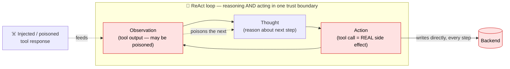
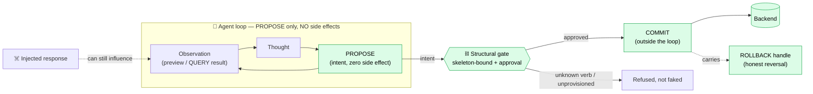

# NILScript — Research & Development Proposal

> **Project:** NILScript — the Network Intent Layer (NIL) + the nilscript DSL
> **Type:** Applied R&D — open standard, reference kernel, and conformance infrastructure for safe agent→backend action
> **Prepared:** 2026-06-18 · **Spec/package version at proposal time:** NIL wire `0.1` (ROLLBACK-extended) · package `0.3.0` · public label **SEQRD-PC v1**
> **Steward:** `nilscript-org` · **License:** CC BY 4.0 (spec text) AND Apache 2.0 (schemas, vectors, SDK)
> **Source of record:** this repository + the design docs in [`docs/`](docs/)

---

## 1. Executive summary

AI agents are moving from *talking* to *acting* — writing to ERPs, commerce backends, ticketing
systems and databases. The moment an agent holds API credentials it becomes a loaded gun: one
hijacked prompt, one hallucinated call, and an irreversible write reaches production. Today every
agent↔system integration is hand-built, brittle, and trusts the model not to misbehave.

**NILScript proposes a structural fix, not a behavioural one.** NIL is a neutral wire contract that
sits between any agent and any backend. An agent can only **propose**; nothing mutates data until a
proposal is **approved**; every effect is **traced** and carries a **reversal handle**; and an agent
can only name operations the backend has actually declared — anything else is **refused, not faked**.
You build the adapter **once**, and any NIL-speaking agent works against it.

The thesis — *Unexpressible, Not Filtered* — is that an undeclared action has an **empty preimage**
under translation (`β⁻¹(a) = ∅`): it is unexpressible, not merely filtered. It is already supported by
an early controlled benchmark: across **2,108 base-setting evaluations** (InjecAgent, ACL Findings
2024) on two models, unauthorized writes **admitted at the gate through NIL = 0.00%**, while the
**authorized-call pass-through stays at 100%** (a false-refusal rate of 0, not measured task
completion). The harness scores gate decisions over tool names, not executed writes; the NIL `0` holds
**by construction** (Proposition 2), not as an estimate from two models. A second axis through a live
odoo-CRM adapter's production edge measures committed effects: **Structural-Rejection Rate = 100%,
Effect-Leakage = 0** across four corpora.

This document defines a **24-month applied-R&D programme** to take NILScript from a working reference
kernel and one verified adapter to a **rigorously benchmarked, independently attested, multi-backend
open standard** with a headless runtime and a clean commercial-durability seam. It is organised into
**six work packages** with explicit objectives, deliverables, TRL targets, KPIs, and a risk register.

---

## 2. Problem statement & motivation

| The problem | Why it is unsolved today |
| --- | --- |
| **Agents write blindly.** A hijacked or hallucinating agent can issue a wrong, irreversible write to a production system. | LLM safety is probabilistic (better prompts, guardrail models). There is no *structural* guarantee that an un-approved write physically cannot commit. |
| **Every integration is bespoke.** Each agent↔backend pairing is hand-built and brittle. | No neutral, language-agnostic wire contract for *actions* exists — the equivalent of "OpenAPI for agent-actions" is missing. |
| **Models hallucinate operations that don't exist.** | Tool layers fabricate plausible-but-wrong calls; nothing forces the agent to stay inside what the backend genuinely exposes. |
| **"It's reversible" is usually a lie.** | Most SaaS effects (sent email, shipped order, charged card) cannot be undone, yet systems imply they can. There is no honest, verifiable reversibility contract. |
| **Standards rot into framework lock-in.** | A standard expressed as software couples adopters to one runtime; the contract should be data, not a dependency. |

**Motivation.** As agentic automation scales, the bottleneck shifts from *capability* to *trust*.
Enterprises will not give autonomous agents write access without a defensible, auditable, reversible
control plane. NILScript targets exactly that control plane — and does so as a **neutral open
standard** so it can become shared infrastructure rather than a single vendor's moat.

---

## 3. Background & state of the art

- **Agent task-success benchmarks** — τ-bench / τ²-bench (ICLR'25), BFCL v3/v4 (ICML'25): measure
  whether agents accomplish tasks against tool suites by comparing end-state to a goal state. They do
  **not** measure a safety/governance layer.
- **Adversarial / safety benchmarks** — AgentDojo (NeurIPS'24), InjecAgent (ACL'24), ToolEmu
  (ICLR'24): measure prompt-injection / hijacked-write susceptibility. These are the venues where a
  structural defence like NIL should *win visibly*.
- **Distributed-systems theory** — the Saga pattern (Garcia-Molina & Salem, 1987) underpins NIL's
  **backward recovery by compensation**: where a true undo is impossible, a *new, governed, forward
  action* neutralises the prior effect's business meaning.
- **Analogous standards** — OpenAPI / JSON-Schema / MCP show the winning shape: the **spec is data +
  docs**, implementations are separate packages. NILScript follows this deliberately.

**Gap NILScript fills.** No existing artefact is *simultaneously* (a) a neutral, language-agnostic
action contract, (b) structurally injection-resistant (propose→approve→commit, skeleton-bounded), and
(c) honest about reversibility with a machine-verified conformance gate. NILScript is positioned in
that intersection.

---

## 4. The technical innovation

### 4.1 The two layers

| Layer | Name | What it is |
| --- | --- | --- |
| **Operations** | **NIL — Network Intent Layer** | The wire contract: a stable `nil: "0.1"` envelope, seven performatives (**SEQRD-PC**: STATUS · EVENT · QUERY · ROLLBACK · DECIDE · PROPOSE · COMMIT), grants, structured refusals, per-domain profiles. |
| **Orchestration** | **nilscript DSL** | A declarative, JSON, LLM-native language *above* NIL: an agent writes a `plan.nil.json` program, a static validator (V1–V6) admits it, a durable runtime walks the graph driving NIL verbs. |

### 4.2 The four structural guarantees (the safety claim)

1. **No side effects on PROPOSE.** A write physically cannot commit without an approved
   `propose → approve → commit`. PROPOSE leaves state byte-identical.
2. **Skeleton-bounded.** An agent can only name verbs/targets the backend's discovery skeleton
   declares (`GET /nil/v0.1/describe`). Unknown verbs → `UNKNOWN_VERB`; unprovisioned targets →
   `UPSTREAM_UNAVAILABLE` (**refused at PROPOSE**, not faked, not failed-after-commit).
3. **Honest, bounded reversibility.** Every verb declares one tier — `REVERSIBLE` / `COMPENSABLE` /
   `IRREVERSIBLE` — and `ROLLBACK` *previews* a compensation through the same PROPOSE→COMMIT
   machinery; it never performs a silent corrective write, and it **refuses to pretend** about
   irreversible effects. Unmarked verbs default to `IRREVERSIBLE` (fail-safe, zero-touch).
4. **Tiers are earned, not asserted.** `nilscript manifest diff` is a CI drift-guard that exits
   non-zero if a shim declares a reversibility tier its conformance run does not honour.

### 4.3 SEQRD-PC — lifecycle closure

`ROLLBACK` is the **terminal lifecycle primitive** — the backward-recovery counterpart to `PROPOSE`.
The performative set spans the complete lifecycle of a governed effect (propose → preview → commit →
notify → reverse) and stays **closed**: it grows only by ratified amendment with a passing conformance
precondition, anchored immutably in an append-only, content-addressed ledger.

### 4.4 Build-once adapters

A backend speaks NIL via a thin **adapter** generated by `nilscript scaffold-shim`. The author fills
exactly three files — `system.py` (the only place I/O happens), `translate.py` (verb ⇄ native),
`compensation.py` (reversibility). A `resource.*` generic CRUD family covers any provisioned target
with **no per-entity verb authoring**, and reversibility is **synthesized** (create→delete,
update→restore-before-image, delete→recreate).

### 4.5 The core architectural claim — breaking the ReAct loop

The dominant agent pattern is **ReAct** (Reason + Act; Yao et al., 2023), adopted across modern agent
stacks — including NVIDIA's agent toolkit. ReAct's defining move is that **acting happens *inside* the
reasoning loop**: the model produces a Thought, takes an **Action that is a real side effect**,
ingests the **Observation** (the tool's output), and feeds it straight back into the next Thought.
That tight fusion is exactly what makes ReAct capable — and exactly what makes it expensive to secure.

**Why ReAct is costly to secure.** Because the Action commits a real effect *every iteration*, and a
returned Observation can be **poisoned** (indirect prompt injection) and **re-enters the reasoning
that picks the next real Action**, the security perimeter is the *entire loop*. There is no
architectural boundary between "deciding" and "doing", so defence is **per-step and probabilistic** —
a guardrail model, a classifier, or a policy prompt inspecting *every* Thought/Action/Observation.
Cost scales with the number of steps (**O(n) per run**) and never reaches a hard guarantee: one
mis-classified step is one unauthorized write.

**How NIL breaks it — architecture, not a better guard.** NIL severs *deciding* from *doing*. The
agent's loop may reason freely and may be influenced by a poisoned observation — but the only thing it
can emit is a **PROPOSE** (intent, **zero side effect**). The actual write happens at **COMMIT**,
**outside the loop**, only after crossing a **structural gate**: the proposal must be approved, and it
can only name verbs/targets the backend's skeleton declares (unknown/unprovisioned → **refused, not
faked**). The security perimeter collapses from "every step of the loop" to **one boundary between
intent and effect** — a fixed, **O(1) architectural** cost, independent of how many steps the agent
takes or how clever the injection is.

**The two architectures side by side:**

| | **ReAct** (action *in* the loop) | **NILScript** (loop *broken*) |
| --- | --- | --- |
| Where a side effect happens | inside the reasoning loop, on **every** Action | **outside** the loop, only at an approved COMMIT |
| A poisoned observation… | directly steers the next **real** Action | can only steer the next **PROPOSE** — still gated |
| Hallucinated operation | executed as a tool call | **refused at PROPOSE** (skeleton-bound) |
| Security perimeter | the whole loop — guard **every iteration** | **one** intent→effect boundary |
| Cost of securing | **O(n)**, per-step, probabilistic (guardrail/classifier each step) | **O(1)**, structural; model-independence holds **by construction** (Proposition 2) |
| Worst-case failure | a silent unauthorized write | an un-approved proposal — **no write** |
| Reversibility | none inherent | declared tier + previewed `ROLLBACK` |

This is why the benchmark column doesn't move: changing the model changes the *raw* (in-loop) hijack
rate, but the NIL column stays **0 by construction** (Proposition 2); the protection is in the
architecture, not the model's judgement, and not an estimate across the two models tested. The research
programme (WP2) exists to **measure exactly this** on the suites reviewers already trust: the
InjecAgent gate-decision axis (already run, 2,108 base-setting evals) and the edge-level SRR/EL axis on
a live adapter.

---

## 5. Current status (baseline / TRL)

| Asset | Status | Evidence |
| --- | --- | --- |
| NIL wire `0.1` + ROLLBACK (SEQRD-PC v1) | **Shipped, additive, backward-compatible** | `src/nilscript/nil/schemas/0.1/`; CHANGELOG 0.3.0 |
| Kernel test suite | **195 tests green** (180 baseline + rollback + MCP tools/dynamic + MCP e2e) | `tests/`, CI |
| Adapter toolkit (`scaffold-shim`, `scan`, `conformance-test`, `manifest`, repair, memory) | **Shipped (6 plan phases)** | `src/nilscript/cli/`; `docs/HANDOFF.md` |
| Reference adapter (PocketBase) | **🟢 Official Verified — offline 16/16, live conformance across all three tiers** | `examples/pocketbase-adapter/`; standalone `pocketbase-nil-adapter` |
| Reference Playground | **Shipped** — `pip install nilscript[demo] && nilscript demo` | `src/nilscript/demo/` |
| Safety benchmark (InjecAgent A/B) | **First result published**: UWR admitted at the gate via NIL = 0.00% / **2,108 base-setting evals** (enhanced withheld), plus edge-level SRR = 100% / EL = 0 on a live odoo-CRM adapter | `bench/`; README "the numbers" |
| Three-tier repo ecosystem + template | **Live** — core, `nil-adapter-template`, official adapter repos | `docs/adapter-ecosystem-strategy.md` |
| Headless runtime kernel | **Shipped in-repo** — `nilscript.kernel` (`validate`, `ValidationContext`, `LocalExecutor`, `RunResult`) + `nilscript run` CLI are wired; saga unwind present | `src/nilscript/kernel/`; `cli/__init__.py:34`; `docs/nilscript-kernel-extraction-plan.md` |
| Generic NIL-MCP server (`nilscript mcp`) | **Shipped in-repo (Phases 0–3)** — `NilClient.rollback()` + `src/nilscript/mcp/` (6 generic tools + skeleton-driven `propose_<verb>` tools over FastMCP) + `[mcp]` extra + `SKILL.md`; **end-to-end proven** (real MCP client over stdio → live FakeSystem shim: describe→propose→commit→rollback); 15 new tests, suite green at 195 | `src/nilscript/mcp/`; `tests/test_mcp_*.py`; `docs/mcp-server-plan.md` |
| Conformance attestation (signed certs) | **Designed (Stage 0 shipped)** — ledger primitives exist; signing/hosting not built | `docs/attestation-design.md` |
| Full benchmark programme (4 axes) | **Planned** — InjecAgent slice done; τ-bench/BFCL/AgentDojo/perf pending | `docs/benchmarking-plan.md` |

**Honest TRL read.** The standard, kernel, toolkit, one verified adapter, and the first safety number
are **real and reproducible** (≈ TRL 4–5 in a controlled/relevant environment). It is a **young open
standard, not yet battle-tested at merchant scale**. This proposal funds the work that moves it to
**TRL 6–7**: independent benchmarks next to public leaderboards, portable attestation, multiple
production adapters, and a headless runtime proven in operational settings.

---

## 6. Research objectives & hypotheses

**O1 — Prove the safety delta on benchmarks reviewers already trust.** Demonstrate, in controlled A/B
(same agent, model snapshot, seed; raw-API vs NIL-gated), that NIL drives the
**Unauthorized-Write Rate (UWR) → 0** *while refusing no authorized call* (authorized-call pass-through
holds), on InjecAgent (gate-decision axis, done) and the edge-level SRR/EL axis, then extends to
AgentDojo, a τ-bench task-success bridge, and additional models. Distinguish gate-decision evidence
(tool names) from edge-level evidence (committed effects).

> *Hypothesis H1:* On established adversarial suites, NIL-gated UWR = 0 with the authorized-call
> pass-through at parity with the raw-API control; model-independent **by construction** (Proposition
> 2: the NIL column does not move because an undeclared action is unexpressible, not because the model
> is judged safe). The planned τ-bench axis adds end-to-end task-success against a goal state.

**O2 — Make conformance portable and tamper-evident.** Turn "CI-green = conformant" into a
**signed, verifiable attestation** binding an adapter commit to the exact spec hash it ran against,
verifiable without trusting anyone's CI runner.

**O3 — Ship a viral headless runtime.** Extract a lightweight, installable execution kernel
(`nilscript run plan.nil.json --adapter-url …`) — validate → walk → dispatch → saga-unwind — with a
<60-second time-to-value loop and a clean seam to a durable cloud executor.

**O4 — Grow the adapter ecosystem to multi-backend breadth.** Reach a critical mass of verified
adapters (commerce, ERP, database, ticketing) so "any NIL-speaking agent works against my backend" is
demonstrably true across domains.

**O5 — Establish protocol-reliability as a first-class, published property.** Prove the wire is
correct under retries, partial failure, and adversarial sequencing via property-based and
fault-injection testing — not just single-run pass.

---

## 7. Work packages

Six work packages. Each lists objective, key tasks, deliverables, TRL target, and the owning design
doc. WPs are sequenced in §8.

### WP1 — Headless runtime kernel + MCP front door (the viral razor)
*Objective (O3).* **The runtime is already shipped in-repo** (`nilscript.kernel` + `nilscript run`,
verified in `src/nilscript/kernel/` and `cli/__init__.py:34`). WP1's remaining work is **hardening
the extraction and adding the one-line MCP adoption wedge.**
- **T1.1** ✅ *(shipped)* Pure DSL engine in `nilscript/kernel/` — `models`, `validator`, `guards`, `references`, `graph`, `context`, `diagnostics`.
- **T1.2** ✅ *(shipped)* `LocalExecutor` (`kernel/executor.py`) + `RunResult` — async walker with saga unwind.
- **T1.3** ✅ *(shipped)* `nilscript run` CLI — load → (optional `--context`) validate → execute → JSON/text trace; non-zero exit on refusal.
- **T1.4** Harden: port the DSL conformance corpus + executor tests against the in-memory `FakeSystem` (provable with **no live backend**); confirm the Phase-3 cloud re-point seam (WP5).
- **T1.5** **Generic NIL-MCP server** (`nilscript mcp`) — one front door so *any MCP-compatible agent* connects once and drives *any* NIL adapter through governed propose→approve→commit→rollback; the **skeleton is the tool surface** (hallucinated verbs aren't even presented). Ship a `SKILL.md` ("Using NILScript") alongside so the agent gets capability *and* the correct usage discipline in one drop. *(The adoption wedge — the one-line connect demo.)*
- **Deliverables:** `nilscript run` + `nilscript mcp` shipped in the wheel; a 30-second cast (install → run → graceful saga unwind) and a one-line MCP-connect demo; DoD = a multi-step plan incl. compensate path runs green in a clean env, and an MCP client drives propose→commit→rollback against `FakeSystem`.
- **TRL target:** 6. **Docs:** `docs/nilscript-kernel-extraction-plan.md` · `docs/mcp-server-plan.md`.

### WP2 — Benchmark programme & publishable proof
*Objective (O1, O5).* Build the two-arm (raw vs NIL-gated) harness and produce numbers publishable
next to known leaderboards.
- **T2.1** A/B harness core (`bench/core/`): `arms.py`, `gate.py` (intent oracle), `nil_tool_bridge.py`, `report.py` (UWR, HVR, benign-success, pass^k, ASR — stamped with model snapshot + dataset commit).
- **T2.2** **Safety headline** — InjecAgent runner (done, extend) + AgentDojo NIL adapter (629 cases, adaptive attacks) + ToolEmu breadth. Report ASR reduction A→B.
- **T2.3** **Task-success rigour** — τ-bench / τ²-bench bridge (retail/airline schema on a NIL shim) reporting `pass^k` next to public baselines; BFCL export via `nilscript export-openapi` → AST runner (hard categories only).
- **T2.4** **Conformance reliability** — `pass^k` over the conformance matrix + a Hypothesis `RuleBasedStateMachine` asserting four invariants (idempotency, rollback-honesty incl. real-record-id compensation, refusal correctness, no-side-effect-on-PROPOSE); Jepsen-style mid-commit fault injection; Pact consumer-driven wire contract.
- **T2.5** Systems performance — coordinated-omission-correct load (wrk2/k6), p50/p90/p99/p99.9, NIL overhead delta, circuit-breaker-under-failure; SPEC reproducibility discipline.
- **T2.6** Reproducibility pack + technical report (seeds, commits, model snapshots).
- **Deliverables:** a reproducible command emitting the full metric set for both arms; a technical report; an optional workshop submission.
- **TRL target:** 5→6. **Doc:** `docs/benchmarking-plan.md`. **Credibility guardrails:** never publish UWR/HVR alone (always paired with benign success); `pass^k` not `pass@k`; pin model+benchmark commits; CO-correct latency only.

### WP3 — Conformance attestation service
*Objective (O2).* Move from Stage 0 (CI-green) to portable signed certificates.
- **T3.1** Stage 1 — write an append-only `attestation` ledger record on each green run (offline + live + manifest), re-deriving `spec_hash` via the existing `compute_spec_hash` / `anchor_ratification` primitives.
- **T3.2** Stage 2 — hosted service that signs the canonicalised record (sigstore/cosign or org Ed25519) and serves signature + record at a stable URL; the badge links a verifiable artefact.
- **T3.3** Stage 3 — consumer-side `nilscript verify-attestation <url>` recomputes `spec_hash`, checks the signature, confirms `adapter_commit`. No trust in anyone's runner.
- **Deliverables:** signed, verifiable conformance certificates; supersede-not-revoke audit trail.
- **TRL target:** 5→6. **Doc:** `docs/attestation-design.md`. **Invariant:** a signature over a failing run is still a failing run — attestation *records* gates, never replaces them.

### WP4 — Adapter ecosystem expansion
*Objective (O4).* Reach multi-domain verified-adapter breadth.
- **T4.1** Harden `scan --url` live probing behind the `--safe` sandbox/teardown design (today only `--replay` is wired).
- **T4.2** Author/verify the next official adapters across domains — commerce (e.g. Salla), database/BaaS (e.g. Supabase), ERP (ERPNext, where a live customer+invoice round-trip already exists), ticketing. Each proves the three gates; **no empty/stub repos published**.
- **T4.3** `generate-in-CI` template automation: a kernel release job regenerates `nil-adapter-template` from `scaffold-shim` so the template never drifts from the generator.
- **T4.4** Adapter-author DX: docs, issue forms, and the "Official Verified vs Community" badge governance (CI-green **and** human security review).
- **Deliverables:** ≥ 4 verified adapters across ≥ 3 domains; live-scan probing; drift-free template.
- **TRL target:** 6→7. **Doc:** `docs/adapter-ecosystem-strategy.md`.

### WP5 — Durability seam & cloud flywheel
*Objective (O3, exploitation).* Keep one DSL engine, two executors.
- **T5.1** Make `wosool-cloud` depend on the published `nilscript.kernel` (delete the vendored DSL copy → single source of truth); cloud keeps only `TemporalExecutor` + worker/gateway/store.
- **T5.2** Document the honest seam: local kernel is best-effort (a crash drops an in-flight run); durability, multi-tenancy, observability, and long human-in-the-loop pauses are the cloud upgrade.
- **T5.3** Optional local `--journal run.jsonl` (SEQRD-PC ledger shape) — audit log, *not* full replay.
- **Deliverables:** a plan validated/previewed locally behaves identically (durably) in the cloud; cloud no longer vendors its own engine.
- **TRL target:** 6. **Doc:** `docs/nilscript-kernel-extraction-plan.md` §5.

### WP6 — Standard governance, docs & dissemination
*Objective (cross-cutting).* Protect the standard and consolidate mindshare.
- **T6.1** Split prose into `nilscript-protocol` (constitution: NIL narratives, DSL guides, SEQRD-PC, GOVERNANCE/VERSIONING) while machine artefacts (schemas, conformance vectors) stay in the kernel wheel; one shared `nilscript.org` domain.
- **T6.2** Ratification RFC (`docs/rfc/0001-seqrd-pc-v1.md`) with a passing-conformance precondition and a signed immutable anchor.
- **T6.3** TS/npm port — **explicitly out of scope for v1**; tracked as a later, community-demand-driven thread (Next.js-native edge).
- **T6.4** Path to **1.0** — the standard's bar: **two independent interoperable implementations** with published conformance reports.
- **Deliverables:** clean prose/artefact split; ratified, anchored standard; documented 1.0 criteria.
- **TRL target:** 7. **Docs:** `docs/seqrd-pc-v0.3-design.md`, `GOVERNANCE.md`, `VERSIONING.md`.

---

## 8. Milestones & timeline (24 months)

| Phase | Months | Focus | Exit milestone (M) |
| --- | --- | --- | --- |
| **P0 — De-risk & lock** | 0–2 | Naming/packaging lock; fix `[cli]→pydantic` coupling; A/B harness skeleton | **M1:** clean-env `nilscript run` on a fake adapter; harness emits one report row |
| **P1 — Kernel + safety headline** | 2–8 | WP1 (kernel) ‖ WP2.1–2.2 (InjecAgent extend + AgentDojo) ‖ WP2.4 (pass^k + Hypothesis) | **M2:** kernel runs a compensate path green; **M3:** AgentDojo+InjecAgent A/B report — UWR≈0, benign parity |
| **P2 — Attestation + rigour** | 6–14 | WP3.1–3.2 (signed certs) ‖ WP2.3 (τ-bench/BFCL) ‖ WP2.5 (perf) | **M4:** signed attestation served + verifiable; **M5:** τ-bench pass^k next to public baselines |
| **P3 — Ecosystem breadth** | 10–18 | WP4 (live scan + 4 adapters) ‖ WP5 (cloud re-point) | **M6:** ≥4 verified adapters / ≥3 domains; **M7:** cloud imports published kernel |
| **P4 — Govern & publish** | 16–24 | WP6 (repo split, RFC, 1.0 criteria) ‖ WP2.6 (report) ‖ WP3.3 (verify-attestation) | **M8:** ratified+anchored standard, reproducibility pack + tech report published |

*Critical path:* WP1 gates the runtime story; WP2 core gates every benchmark; do not re-point the
cloud (WP5) until the kernel is proven (avoid destabilising production mid-extraction).

---

## 9. Evaluation framework & KPIs

| Dimension | Metric | Target | Source |
| --- | --- | --- | --- |
| **Safety (gate-decision)** | Unauthorized-Write Rate admitted at the gate via NIL | **0.00%** (by construction) across models | WP2.2 |
| **Safety (edge-level)** | Structural-Rejection Rate / Effect-Leakage via a live adapter edge | **SRR = 100% / EL = 0** | WP2.2 |
| **No false refusals** | Authorized-call pass-through, NIL vs raw arm (false-refusal rate, NOT task completion) | 100% (no authorized call refused) | WP2.2 |
| **Capability preserved** | End-to-end task-success vs goal state, NIL vs raw arm (planned τ-bench axis) | within statistical noise | WP2.3 |
| **Model-independence** | by construction (Proposition 2); UWR variance across model snapshots | NIL column flat by construction while raw moves | WP2.2 |
| **Protocol reliability** | conformance `pass^k` (k=8) | **1.0** | WP2.4 |
| **Invariants** | property-tested invariants over generated sequences | 4/4 green over M sequences | WP2.4 |
| **Overhead** | NIL gate latency delta (CO-correct p99) | small vs LLM call latency, honestly reported | WP2.5 |
| **Attestation** | signed certs independently verifiable | yes (no runner trust) | WP3 |
| **Ecosystem** | verified adapters / domains | **≥ 4 / ≥ 3** | WP4 |
| **Standard maturity** | independent interoperable implementations | **2** (the 1.0 bar) | WP6 |

**Anti-tautology discipline (load-bearing).** UWR/HVR are *never* reported alone — a never-act agent
scores "perfectly safe." Every safety number is published as the **pair** `(authorized-call
pass-through vs the raw-API control, UWR/HVR under attack)`, where the pass-through is a false-refusal
rate of 0 (no authorized call refused), not measured task completion. The intent-oracle gate makes the
delta non-trivial; end-to-end task-success against a goal state is the separate, planned τ-bench axis.

---

## 10. Risk register

| # | Risk | L×I | Mitigation |
| --- | --- | --- | --- |
| R1 | **Benchmark credibility attacked** (pass^k vs pass@k, CO latency, UWR-alone tautology, stale baselines) | M×H | Follow `benchmarking-plan` §7 guardrails verbatim; pair every safety number with benign success; pin model+commit; CO-correct tools; adversarial 3-vote verification of every published claim |
| R2 | **Two executors drift** (local kernel vs cloud Temporal) | M×H | WP5: cloud imports the *published* `nilscript.kernel` — one validator/guards/refs source |
| R3 | **Identity churn** — `nilscript` meaning shifts from "the standard" to "the kernel" | M×M | Additive, not a rename; `pip install nilscript` keeps working and *gains* `run`; crisp CHANGELOG; spec preserved as the Protocol |
| R4 | **Local durability misunderstood as a guarantee** | M×M | Docs state plainly: local kernel is best-effort; durability is the cloud upgrade; optional `--journal` is audit-only |
| R5 | **Tool→verb mapping gaps inflate benchmark results** | M×M | Report coverage %; never silently drop unmappable cases |
| R6 | **Attestation over-claimed before the service exists** | L×H | Do not advertise signed certificates until Stage 2 ships; "certified" = three gates green until then |
| R7 | **Ecosystem stalls** (no community adapters) | M×M | Lower author friction (3 files, template, live scan, DX docs); seed official adapters across domains first |
| R8 | **Scope creep into npm/TS prematurely** | M×M | TS port explicitly out of v1 scope; Python kernel proven and viral first |
| R9 | **`[cli]` install pulls `pydantic`** (light-CLI claim false) | H×L | Make SDK import lazy before any PyPI light-CLI claim (HANDOFF tech-debt #1) |

*(L×I = likelihood × impact, L/M/H.)*

---

## 11. Team & resources

- **Core kernel & standard** — protocol design, validator/guards/refs, SEQRD-PC governance, RFC/anchor.
- **Benchmarks & evaluation** — A/B harness, bridges (InjecAgent/AgentDojo/τ-bench/BFCL), property &
  fault testing, CO-correct perf, reproducibility pack.
- **Adapter ecosystem & DX** — live scan, official adapters, template automation, author docs/review.
- **Attestation & infra** — ledger records, signing service, `verify-attestation`, hosting.
- **Cloud durability (Wosool)** — `TemporalExecutor`, re-point onto the published kernel.

**Infrastructure:** CI (kernel + cross-repo parity gate already live); benchmark compute (model API
budget for two-arm A/B at scale); backend service containers for live conformance; a signing/hosting
service for attestations; docs-site hosting on `nilscript.org`.

---

## 12. Dissemination & exploitation

- **Open standard first.** Spec text CC BY 4.0; schemas/vectors/SDK Apache 2.0. Openly governed under
  `nilscript-org`. The path to **1.0 requires two independent interoperable implementations** — the
  standard cannot be a single-vendor artefact.
- **Viral OSS razor.** `pip install nilscript && nilscript run` — a <60-second loop; the 30-second
  saga-unwind cast is the whole pitch. README hero + docs-first protocol site.
- **Academic dissemination.** A reproducibility-pack technical report (and a possible workshop paper)
  built on peer-reviewed anchors (τ-bench, AgentDojo, InjecAgent) — the publishable A/B delta.
- **Commercial flywheel (the blade).** The OSS kernel is free, local, viral; **Wosool Cloud** is the
  same engine made durable, multi-tenant, observable, and dashboarded. Durability is the honest
  upsell and the business moat — *not* a different language. Adapters built for the OSS kernel are the
  cloud's plugin ecosystem; no work is wasted.

---

## 13. Summary of deliverables

1. **Headless runtime** — `nilscript run` shipped in the wheel, provable with no live backend (WP1).
2. **Benchmark suite + technical report** — two-arm A/B across four axes, reproducibility pack (WP2).
3. **Signed conformance attestation** — portable, verifiable certificates + `verify-attestation` (WP3).
4. **≥ 4 verified adapters across ≥ 3 domains** + live `scan` + drift-free template (WP4).
5. **Single-engine cloud seam** — `wosool-cloud` on the published kernel (WP5).
6. **Ratified, anchored standard** + clean prose/artefact repo split + documented 1.0 criteria (WP6).

---

## 14. References (project docs & external anchors)

**Internal (this repo):** [`README.md`](README.md) · [`CHANGELOG.md`](CHANGELOG.md) ·
[`IMPLEMENTATIONS.md`](IMPLEMENTATIONS.md) · [`docs/nilscript-kernel-extraction-plan.md`](docs/nilscript-kernel-extraction-plan.md) ·
[`docs/benchmarking-plan.md`](docs/benchmarking-plan.md) · [`docs/attestation-design.md`](docs/attestation-design.md) ·
[`docs/adapter-ecosystem-strategy.md`](docs/adapter-ecosystem-strategy.md) · [`docs/seqrd-pc-v0.3-design.md`](docs/seqrd-pc-v0.3-design.md) ·
[`docs/HANDOFF.md`](docs/HANDOFF.md) · [`bench/`](bench/).

**External anchors:** ReAct — Reason+Act agent loop (Yao et al., arXiv 2210.03629, ICLR'23;
adopted across modern agent stacks incl. NVIDIA's agent toolkit) · τ-bench (arXiv 2406.12045, ICLR'25) · τ²-bench (arXiv 2506.07982) ·
BFCL v3/v4 (ICML'25) · AgentDojo (arXiv 2406.13352, NeurIPS'24) · InjecAgent (arXiv 2403.02691,
ACL Findings'24) · ToolEmu (arXiv 2309.15817, ICLR'24) · Saga pattern (Garcia-Molina & Salem, 1987) ·
Hypothesis stateful testing · Jepsen · Pact · wrk2 / coordinated omission · SPEC RG reproducibility.

---

*This is a proposal/roadmap, not an implementation record. It synthesises the repository's shipped
state with the design docs' planned work into a fundable R&D programme. Every claim of current status
is grounded in the cited file; every forward claim is marked as planned and owned by a work package.*
