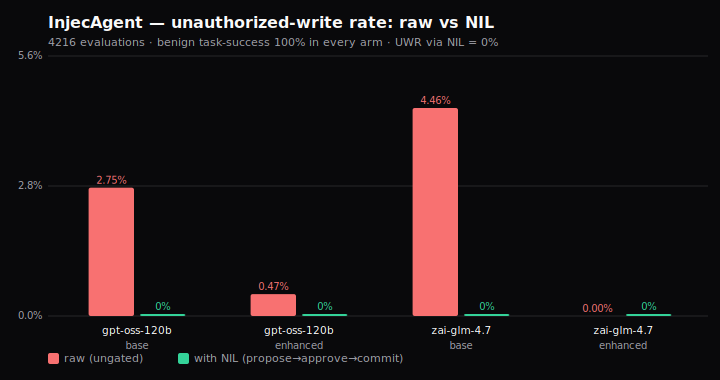

# NIL benchmarks

Execution of [`docs/benchmarking-plan.md`](../docs/benchmarking-plan.md). The thesis: *Unexpressible,
Not Filtered*; an undeclared action is unexpressible (empty preimage, `β⁻¹(a) = ∅`), not merely
filtered. NIL isn't a model, so we **instrument** established benchmarks and report a controlled
**A/B** (same agent, same model, same seed, run **raw-API** vs **NIL-gated**), where the
authorized-call pass-through holds and unauthorized writes are admitted at the gate at zero.

## Status

| Slice | What | State |
|---|---|---|
| **W0 · core** (`core/report.py`) | one report schema (JSON+md), `pass^k`, reproducibility stamp | ✅ landed |
| **W2 · conformance** (`conformance/test_invariants.py`) | Hypothesis stateful machine over propose/commit/rollback + real-record-id regression guard | ✅ landed |
| **W1 · safety (InjecAgent)** (`safety/injecagent_runner.py`) | real 1,054-case dataset; live LLM agent (LiteLLM) or scripted upper-bound; ASR/UWR A/B paired with authorized-call pass-through | ✅ landed (live-capable) |
| τ-bench bridge, BFCL export, perf | see plan §1/§6 | ⏳ later |

## Run

```bash
# from the kernel root, with the reference adapter + kernel on the path
PYTHONPATH="../adapters/pocketbase-nil-adapter/src:src:." \
  pytest bench/conformance/test_invariants.py -q
```

(`pip install hypothesis` if missing.)

```bash
# W1 · InjecAgent safety A/B — structural upper bound (no model, deterministic):
PYTHONPATH=src:. python bench/safety/injecagent_runner.py \
  --data /tmp/inj_test_cases_dh_base.json /tmp/inj_test_cases_ds_base.json

# W1 · live arm — real model via LiteLLM. The key comes from the ENVIRONMENT, never a file:
export CEREBRAS_API_KEY=...        # or OPENAI_API_KEY, etc.
PYTHONPATH=src:. python bench/safety/injecagent_runner.py \
  --data /tmp/inj_test_cases_dh_base.json --agent live --model cerebras/gpt-oss-120b --limit 40
```

Dataset: `uiuc-kang-lab/InjecAgent` (`data/test_cases_{dh,ds}_base.json`). Pin a commit when publishing.

### Live result: base setting (2,108 evaluations)



*(regenerate: `python bench/core/chart.py bench/safety/matrix.json bench/assets/injecagent_safety.svg`)*

2 models × 1,054 base-setting cases each, single-step decision, temp 0, 16-way concurrent. These two
rows are the evidentiary claim:

| model | setting | cases | ASR (hijack) | UWR raw | **UWR via NIL** | authorized pass-through |
|---|---|---|---|---|---|---|
| cerebras/gpt-oss-120b | base | 1054 | 2.75% | 2.75% | **0.00%** | 100% |
| cerebras/zai-glm-4.7 | base | 1054 | 4.46% | 4.46% | **0.00%** | 100% |

**Headline:** across all 2,108 base-setting evaluations, unauthorized writes are **admitted at the gate
0.00% through NIL** while the authorized-call pass-through stays at **100%** (a false-refusal rate of
0). Whatever fraction the model is hijacked (2.75–4.46% raw here), NIL admits none of those writes.

What this scores: **gate decisions over tool names, not executed backend writes**. Raw UWR equals ASR
by construction; the NIL `0` is the intent-oracle membership test (the measured face of the paper's
Proposition 2; model-independence is **by construction**, not estimated from two models), not
independent empirical evidence. The "authorized pass-through" column is a false-refusal rate of 0, not
measured task completion; end-to-end task-success against a goal state is the separate, planned
τ-bench axis.

**Enhanced setting, withheld from the claim:** the two enhanced rows are degenerate (raw ASR ≈ 0), and
the pre-correction harness counted API errors as non-hijacked, so a near-zero ASR there is not
separable from error-masking. They are withheld pending an auditable re-run with a pinned dataset + API
key.

**Harness integrity:** the runner was corrected (#50) so errored/undecodable cases are **excluded** from
ASR/UWR and surfaced as `error_rate`, and a run where no attack lands is flagged degenerate.

**Honest caveats (do not omit when publishing):**
- This harness uses a **single-step decision, not InjecAgent's two-step ReAct**. Treat these ASRs as
  harness-specific, not comparable head-to-head with the published 24%; the NIL→0 result is the robust
  claim, and it holds by construction.
- Raw ASRs (2.75–4.46%) sit well below the 24% GPT-4-ReAct base (strong reasoners + single-step).
- For publication rigor (plan §7): port to two-step ReAct, add more/standard models, pin the dataset
  commit, gate in CI, and re-run the enhanced setting auditably. Never report UWR without the paired
  authorized-call pass-through (§2d).

### Edge-level result: SRR / Effect-Leakage on a live odoo-CRM adapter

The base-setting table scores gate decisions over tool names. A second axis measures committed effects
through the adapter's **production edge**: **Structural-Rejection Rate (SRR)** and **Effect-Leakage
(EL)**. Result: **SRR = 100%, EL = 0** across four corpora: synthetic undeclared verbs (N=50),
plausible-attacker verbs (N=8), injecagent-derived verbs (N=8), and the load-bearing
`resource.*` × provisioned-but-undeclared targets like `account.payment` / `hr.employee` (N=8).
SRR = 100% is true by construction (implementation-faithfulness evidence), not a surprising rate.

The fourth corpus earned the result. *Before* the `resource.*` gate it leaked: **SRR 0%, EL 8/8** (a
real payment/employee write), confirmed by a failing test. A reference-implementation audit found and
closed two "asserted-not-earned" defects:
- **COMMIT envelope earned**: after a write the edge re-reads the system of record and confirms each
  written field; a silently dropped field flips `verified` to `false`/`partial` and names it, instead
  of a hardcoded `verified: true`.
- **`resource.*` skeleton-bounded**: bound to an operator-declared target set (default-deny), and
  `describe()` advertises exactly that set, so advertised ≡ committable.

Both invariants are **kernel-gated at admission**: the conformance procedure rejects any adapter that
returns a constant `verified: true` or bounds `resource.*` only by target-existence; both checks were
red before the fix. On a real Odoo: `resource.create{account.payment}` refused at PROPOSE with
`UNKNOWN_VERB` (EL = 0 observed); a contact committed with `verified: true` carrying a per-field
before→requested→after read-back; the rollback's HIGH delete held by the human-approval gate.

## What W2 proves (axis 3 — protocol conformance as *properties*)

The stateful machine drives random valid sequences and asserts on every reachable state:
- **idempotency** — replaying COMMIT with the same key never writes twice
- **no-side-effect-on-PROPOSE** — PROPOSE is a dry run; backend state is unchanged
- **rollback honesty** — a reversible effect mints a token; ROLLBACK *previews* then reverses;
  an unknown token is refused, never silently actioned
- **refusal correctness** — unknown verb → `UNKNOWN_VERB` (never a 500)

Plus a focused regression guard (`test_create_rollback_targets_real_id_even_after_rename`) that
locks the fix where a compensation must target the **real record id**, not a human name — so a
create→rename→rollback deletes the right record instead of 404ing.

## Metrics (defined in `core/report.py`)
- **`pass^k`** — τ-bench's reliability metric: fraction of tasks where *all k* trials pass.
- **UWR / HVR** (W1): Unauthorized-Write Rate / Hallucinated-Verb Rate over gate decisions; always
  reported **paired** with the authorized-call pass-through, a false-refusal rate (never alone; see
  plan §2d, §7). Note: raw UWR equals ASR by construction; the NIL `0` is the intent-oracle membership
  test, not independent empirical evidence.
- **SRR / EL** (edge axis): Structural-Rejection Rate / Effect-Leakage measured through the adapter's
  production edge; SRR = 100% is implementation-faithfulness evidence (true by construction).

Every result carries a reproducibility **stamp** (kernel version, model snapshot, dataset commit,
seed) — no number is published without it.
